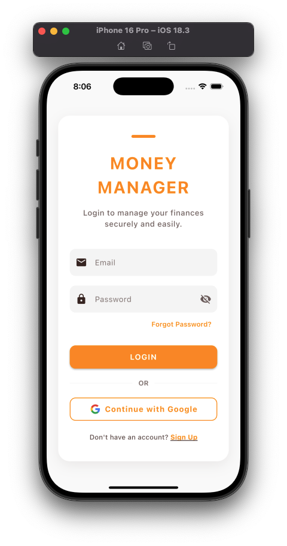
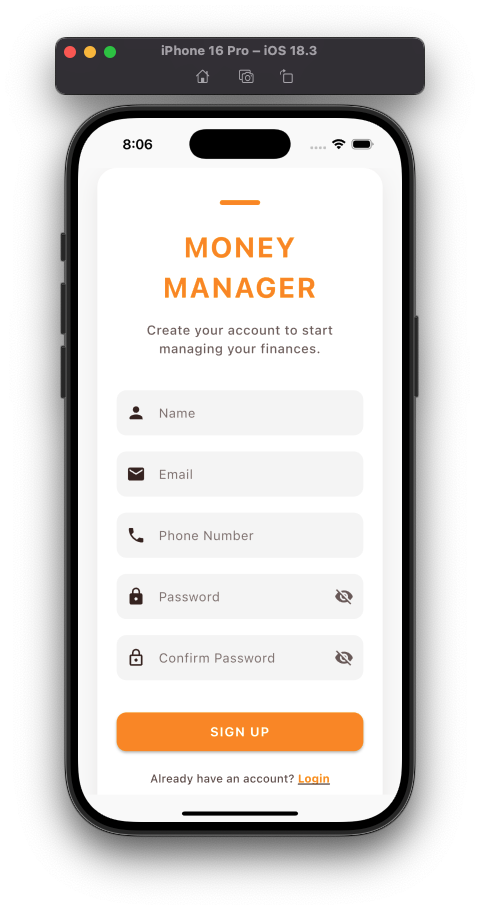
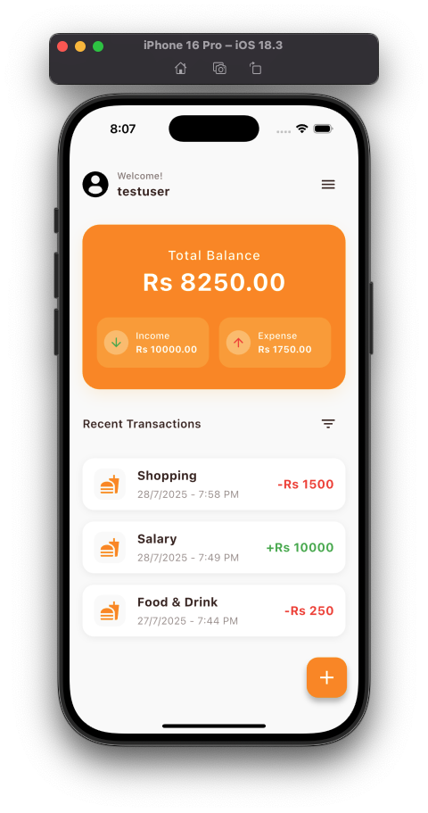
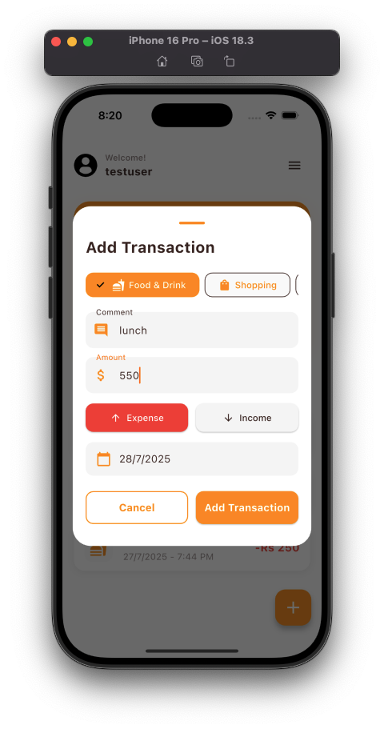

# Money Manager App

A cross-platform Flutter application to help users track, manage, and analyze their personal finances with ease.

## About

Welcome to the Money Manager App! This app is designed to empower you to take control of your finances by tracking your income and expenses, visualizing your balance, and managing your transactions securely. With a modern UI and seamless experience, you can manage your money anytime, anywhere.

## Features

- User registration and secure login (Node.js backend, MongoDB)
- Add, view, and manage transactions (income & expenses)
- Real-time calculation of total balance, income, and expense
- Transaction details popup for each entry
- Persistent user session
- Responsive and modern UI
- Cross-platform: Android, iOS, Web, Desktop

## Tech Stack

**Frontend:**
- Flutter (Dart)

**Backend:**
- Node.js
- Express.js
- MongoDB (Mongoose)


## Screenshots

### Get Started Page


### Login Page


### Sign Up Page


### Home Page


### Add Transaction Page


## Getting Started

### Installation

1. Clone the repository:
```bash
git clone https://github.com/chamudithaperera/Flutter-Dart-project-10-Money-Manager-app.git
```

2. Navigate to the project directory:
```bash
cd Flutter-Dart-project-10-Money-Manager-app/money_manager
```

3. Install Flutter dependencies:
```bash
flutter pub get
```

4. Install backend dependencies:
```bash
cd API
npm install
```

5. Start the backend server:
```bash
node index.js
```

6. Run the app:
```bash
flutter run
```

## Data Safety

- User data is securely stored in MongoDB
- No data shared with third parties

## Contributing

Contributions are welcome! Please feel free to submit a Pull Request.

## License

This project is licensed under the MIT License - see the LICENSE file for details.

## Author

- Chamuditha Perera
- GitHub: [@chamudithaperera](https://github.com/chamudithaperera)
- LinkedIn: [Chamuditha Perera](https://www.linkedin.com/in/chamudithaperera)
- Email: chamudithaperera.dev@gmail.com

## Support

For any support or queries, please contact:
- Email: chamudithaperera.dev@gmail.com
